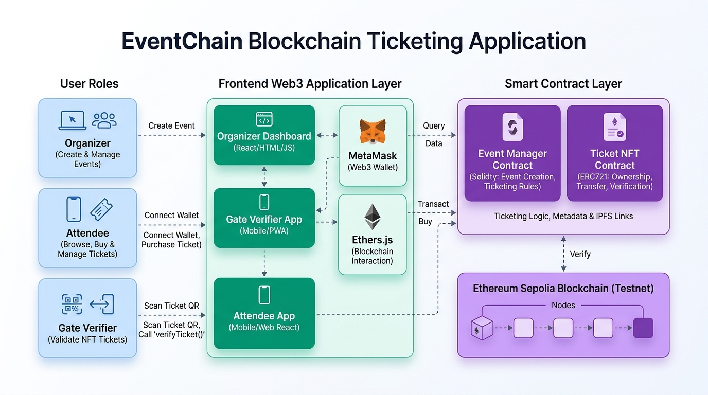

# 🎫 EventChain: Simple & Secure Blockchain Event Ticketing

EventChain is a modern, tamper-proof digital ticketing web application. It eliminates counterfeit tickets and unfair ticket scalping by issuing tickets as authentic digital passes on the Ethereum blockchain.

---

## 🏗️ System Architecture



---

## 🌟 Key Features

- **No Fake Tickets:** Every ticket is unique and stored directly on the blockchain.
- **Anti-Scalping Price Cap:** Organizers set maximum resale prices to stop scalpers from overcharging.
- **Door Check-In Scanner:** Venue staff can scan QR codes or type ticket IDs to verify validity and check in attendees in one click.
- **Transfer Tickets Safely:** Attendees can easily send tickets to friends directly between Web3 wallets.
- **Beginner-Friendly Interface:** Clean light theme with straightforward everyday English and a 3-step guide.

---

## 📁 File Structure

```text
eventchain_blockchain/
│
├── 📂 contracts/                        # Smart Contracts (Solidity)
│   ├── EventChainContract.sol           # Core NFT Ticket Contract (ERC-721 + History + Resale Cap)
│   ├── EventChainEventManagerContract.sol # Event Manager Contract (Creates Events & Issues Tickets)
│   ├── IEventChainContract.sol          # Ticket Contract Interface
│   └── IEventChainEventManagerContract.sol # Event Manager Interface
│
├── 📂 frontend/                         # Web Application (User Interface)
│   ├── index.html                       # Homepage (Events List & How-To Guide)
│   ├── organizer.html                   # Create Events & Send Tickets
│   ├── tickets.html                     # My Tickets Vault (QR Passes & Transfers)
│   ├── verifier.html                    # Door Check-In Scanner
│   ├── settings.html                    # Network & Contract Addresses
│   ├── styles.css                       # Clean Light Theme Stylesheet
│   └── app.js                           # Web3 Connection & Contract Logic
│
├── 📂 ignition/modules/                 # Deployment Script
│   └── EventChain.js                    # Broadcasts contracts to Ethereum Sepolia
│
├── 📄 .env                              # Network RPC & Private Key configuration
├── 📄 architecture.png                  # System Architecture Diagram (Light Theme)
├── 📄 hardhat.config.js                 # Hardhat configuration
├── 📄 package.json                      # Project dependencies & runnable scripts
└── 📄 README.md                         # Project documentation
```

---

## 🌐 Live Deployed Contracts (Ethereum Sepolia Testnet)

| Contract | Address | Network | Explorer |
| :--- | :--- | :--- | :--- |
| **EventChainContract (Tickets)** | `0xA28adE8605F1E58FE455d6698d19a508C721D761` | Sepolia (11155111) | [View on Etherscan](https://sepolia.etherscan.io/address/0xA28adE8605F1E58FE455d6698d19a508C721D761) |
| **EventChainEventManagerContract** | `0x6D9109e282e4259952232998004DcA75a9c0CE5c` | Sepolia (11155111) | [View on Etherscan](https://sepolia.etherscan.io/address/0x6D9109e282e4259952232998004DcA75a9c0CE5c) |

---

## 🚀 Getting Started

### 1. Install Dependencies
```bash
npm install
```

### 2. Configure Environment (`.env`)
Ensure your `.env` contains your Sepolia RPC and private key:
```env
SEPOLIA_URL=https://ethereum-sepolia-rpc.publicnode.com
ACCOUNT_PRIVATE_KEY=your_private_key_here
```

### 3. Start the Web App
```bash
npm run serve
```
Open **`http://localhost:3000`** in your browser.

---

## 🛠️ Deploying Contracts (Optional)

If you modify the Solidity contracts in `contracts/`, you can deploy fresh instances using:

```bash
# Compile contracts
npx hardhat compile

# Deploy to Ethereum Sepolia
npm run deploy:sepolia
```

---

## 📖 How It Works

1. **Connect Wallet:** Click "Connect Wallet" at the top right using MetaMask.
2. **Create Event:** Organizers enter event details and ticket prices in the **Create Event** tab.
3. **Issue Tickets:** Organizers send digital tickets directly to guests' wallet addresses.
4. **Door Check-In:** Guests show their ticket QR code at the entrance, and staff use the **Check-In Scanner** to let them in.
